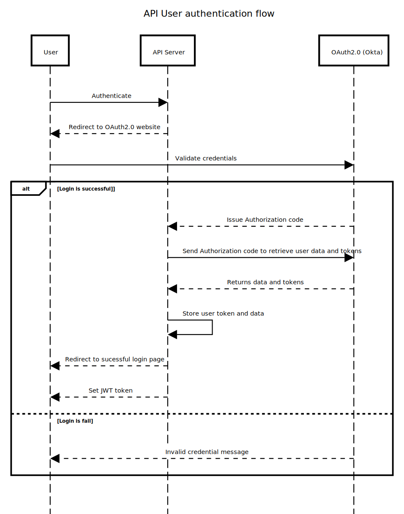

# Questions

## 2.1 Architecture Design
> Write a short paragraph about what architecture design you would choose to deploy your API in a production environment and associated technologies.

A efficient way to deploy in a production environment could be done using microservices architecture which would ease the update, upgrade and scaling of APIs without impacting other services.

Key components of this deployment include :

- Containerization : Using **Docker** to package our application components into lightweight, portable containers
- Orchestration : **Kubernetes** to simplify the deployment process by managing our containers, handling scaling, resource allocation, and ensuring high availability. Using Kubernetes also ensure the consistency and reliability across all our environments.
- CI/CD pipelines : **GitHub Actions** enable automated testing, integration, and deployment of our application. The workflow will pack our application into Docker images that are then deployed to Kubernetes clusters.
- Cloud Services : Integration with **AWS** boosts the deployment capabilities, using services such as Elastic Kubernetes Service (EKS) for managed Kubernetes clusters and AWS Lambda for serverless functionality.
- Monitoring : Utilizing **Grafana** and **Prometheus** enables comprehensive monitoring of performance metrics for both our infrastructure appliances and deployed APIs.

## 2.2 UML Sequence Diagram
> Create a UML sequence diagram explaining the user authentication flow you would use to securely access the API endpoints and explain what design pattern(s) you would use to secure your endpoints in FastAPI.

In FastAPI, depending on the project, I will either implement JWT token authentication using local database or OAuth2.0 using *fastapi-security* library.
For JWT Authentication, the sequence diagram would illustrate the following steps:

Similarly, for OAuth2.0 Authentication, the sequence diagram would depict the following steps:

The implementation will be done in the middleware for global authentication to all routes, ensuring consistent authentication across the application. Alternatively, it can be implemented directly in my API route code using *Depends* in the API function parameters for more granular control, allowing authentication to be applied to specific endpoints based on user roles or permissions.

## 2.3 Feedback and Improvements
> Please provide some feedback on what improvements you would make or alternative approach you would take if given more time, and any difficulties you might have encountered during the process.

Given more time, I would have prioritized test-driven development (TDD) from the beginning of the development process. By prioritizing the setup of Git, CI/CD pipelines, and writing tests before implementing API routes, I could ensure better code quality and maintainability throughout the project's lifecycle.

In terms of improvements, I would enhance error management by implementing try-except blocks to raise detailed exceptions, providing more informative error messages to users. Additionally, I would introduce a logging system to track API calls and generate logs for better analysis and troubleshooting in case of errors or issues.

With regard to future functionalities, I plan to enhance the device APIs by incorporating features such as device update history and introducing API routes for coordinates management. These additions would require the creation of additional tests to ensure full coverage of new features and increase the reliability of existing features through more tests.

Given more time, I would also explore the use of a dedicated database in a container to improve data management improving project scalability and data processing capabilities. In addition, I would take this opportunity to further explore the use of SQLAlchemy for database management.
